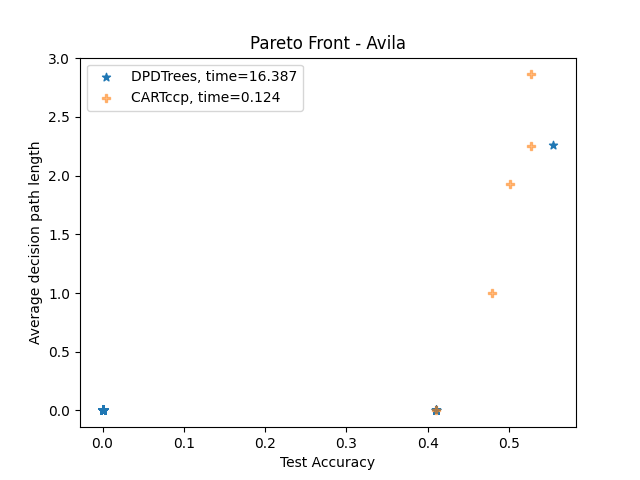

## Quickstart

```bash
pip install -e .
```

```python
from dpdt import DPDTree
from sklearn import datasets
from sklearn.tree import DecisionTreeClassifier


X, y = datasets.load_breast_cancer(return_X_y=True)

# DPDT
clf = DPDTree(max_depth=3)
clf.fit(X, y)
print(clf.score(X, y))

#CART
clf = DecisionTreeClassifier(max_depth=3)
clf.fit(X,y)
print(clf.score(X, y))
```

## DPDT is used to find trees that generalize at least as well as CART trees but that have shorter decision path in average. 

