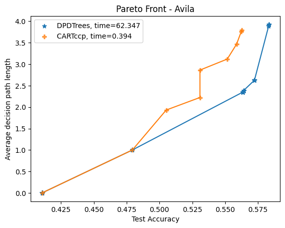

## DPDTree
Finding an optimal decision tree for a supervised learning task is a challenging combinatorial problem to solve at scale. DPDT frames the problem as a Markov Decision Problem (MDP). In the MDP, each trajectory corresponds to a sequence of tests on training data until a class is assigned. Potential tests are obtained by calling CART [Breiman, 1984](https://www.taylorfrancis.com/books/mono/10.1201/9781315139470/classification-regression-trees-leo-breiman), and dynamic programming is used to induce the best sequence of tests, i.e the best decision trees. By definition, the train accuracy of DPDT will always be greater than CART. One other property of DPDT is that its trees pareto dominate CART' w.r.t the trade-off between the average decision path length and the test accuracies. See e.g.:


It is also possible to add feature costs when fitting the tree.  
It is also possible to do regression, including multi-output regression.

## Installation
```bash
pip install git+https://github.com/KohlerHECTOR/dpdt-py.git@v0.2.6
```


## Usage
DPDTree uses the ```scikit-learn``` API. You can find advanced examples [here](https://github.com/KohlerHECTOR/dpdt-py/blob/main/examples/).

```python
from dpdt import DPDTreeClassifier
from sklearn import datasets
from sklearn.tree import DecisionTreeClassifier


X, y = datasets.load_breast_cancer(return_X_y=True)

# DPDT
dpdt = DPDTreeCLassifier(max_depth=3, random_state=42)
dpdt.fit(X, y)

#CART
cart = DecisionTreeClassifier(max_depth=3, random_state=42)
cart.fit(X, y)
assert dpdt.score(X, y) >= cart.score(X, y)
```

### Cite

```bibtex
@misc{interpretabledecisiontreesearch,
      title={Interpretable Decision Tree Search as a Markov Decision Process}, 
      author={Hector Kohler and Riad Akrour and Philippe Preux},
      year={2024},
      eprint={2309.12701},
      archivePrefix={arXiv},
      primaryClass={cs.LG},
      url={https://arxiv.org/abs/2309.12701}, 
}
```
